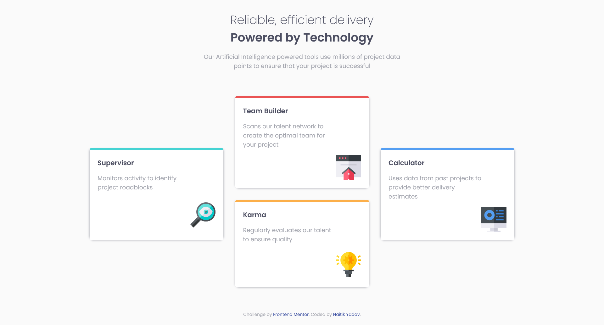

# Frontend Mentor - Four card feature section solution

This is a solution to the [Four card feature section challenge on Frontend Mentor](https://www.frontendmentor.io/challenges/four-card-feature-section-weK1eFYK). Frontend Mentor challenges help you improve your coding skills by building realistic projects.

## Table of contents

- [Overview](#overview)
  - [The challenge](#the-challenge)
  - [Screenshots](#screenshots)
  - [Link](#link)
- [My process](#my-process)
  - [Built with](#built-with)
  - [What I learned](#what-i-learned)
  - [Useful resources](#useful-resources)
- [Author](#author)

## Overview

### The challenge

Users should be able to:

- View the optimal layout for the site depending on their device's screen size

### Screenshots




### Link

- Live Site URL: [GitHub Pages](https://n4itik.github.io/four-card-feature-section/)

## My process

### Built with

- Semantic HTML5 markup
- CSS custom properties
- Flexbox
- CSS Grid
- Mobile-first workflow

### What I learned

This project enabled me to play around with grid template areas a little more and use them to make the layout required.

```css
.card-grid {
  grid-template-areas:
    ". two ."
    "one two four"
    "one three four"
    ". three .";
}
```

### Useful resources

- [Learn CSS Grid the easy way](https://www.youtube.com/watch?v=rg7Fvvl3taU) - This helped me a lot with grid template areas. I really liked this approach of grid layout and will continue to use it.

## Author

- Frontend Mentor - [@n4itik](https://www.frontendmentor.io/profile/n4itik)
- Linktree - [Naitik Yadav](https://linktr.ee/naitikyadav)
